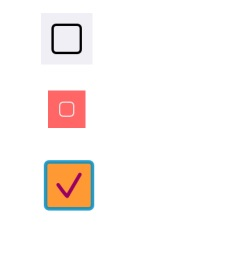

# WOWCheckbox

[](https://travis-ci.org/Zhou Hao/WOWCheckbox)
[](http://cocoapods.org/pods/WOWCheckbox)
[](http://cocoapods.org/pods/WOWCheckbox)
[](http://cocoapods.org/pods/WOWCheckbox)

Highly customisable checkbox in Swift. Drag to Storyboard and set the properties.



## Example

To run the example project, clone the repo, and run `pod install` from the Example directory first.

## Requirements

## Installation

WOWCheckbox is available through [CocoaPods](http://cocoapods.org). To install
it, simply add the following line to your Podfile:

```ruby
pod "WOWCheckbox"
```

## Author

Zhou Hao, zhou.hao.27@gmail.com

## License

WOWCheckbox is available under the MIT license. See the LICENSE file for more info.
